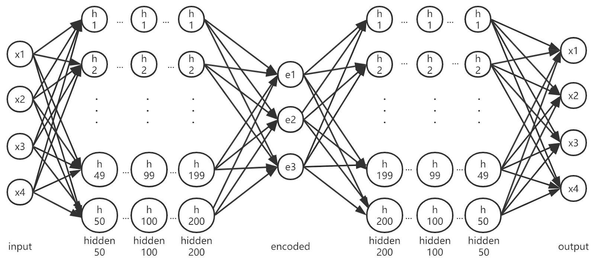
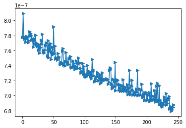
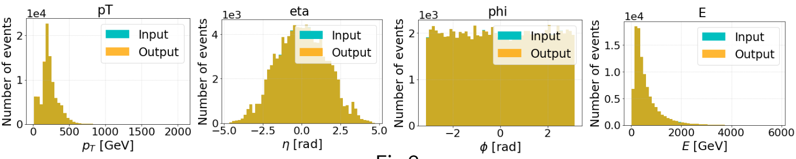
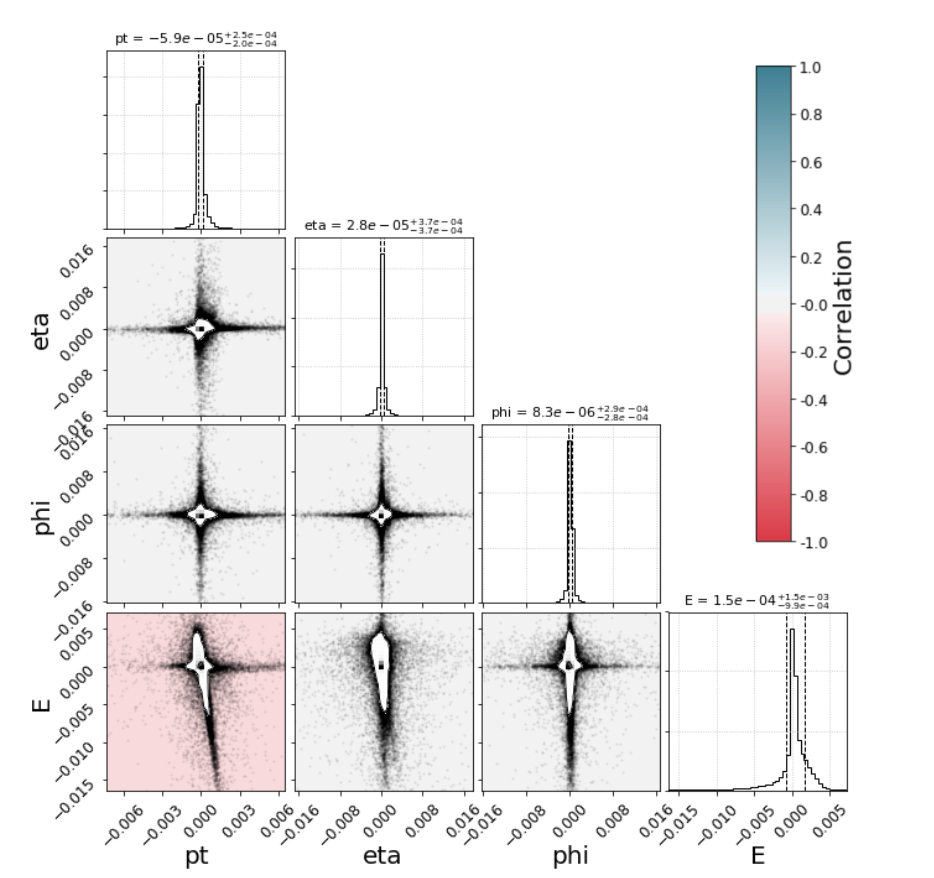

# ATLAS Autoencoders Network Introduction and Report

## How Network Learn? 

A neural network is made up of neurons. A neuron takes an n-dimensional vector ($x_i$) as input and computes its weighted sum according to their weight ($w_i$). Next, the sum is fed to a non-linear activation function ($f(x)$) and finally yields the output scalar y.

However, the output y not always has the same value as we expected. Gradient descent  helps the neuron update its weight to narrow down the gap between the output y and the ground truth value. After some iterations, the error can be minimized. 

If a network has many neurons, it can learn more complex features hidden in the input dataset.

## What Is An Autoencoder Network?

An autoencoder is a network with a specific structure - an encode network (encoder) and a decode network (decoder).  

An encoder takes the raw data (x) as input and outputs the encoded data (a), which has a smaller size than the raw data, and thus, the data is compressed then. A decoder, conversely, try to decode the encoded data into the original ones (x_hat).

When training, the autoencoder network encodes, then decodes the raw data, and update the weights to minimize the differences between the raw data and decoded ones. After that, the well-trained autoencoder is able to encode data into a smaller size and decode them to the original ones when needed.

## Structure of the AE_3D_200 Autoencoder

The raw data are 139723  four-dimensional vectors, representing the E, p_t, eta angle and phi angle respectively. They will be compressed  (encoded) to three-dimensional vectors using the following autoencoder.

The AE_3D_200 autoencoder is a fully-connected network, with 50, 100, 200, 3 ,200, 100, 50 neurons in each hidden layer respectively. The activation function is tanh(x). An illustration of the network structure is shown in the figure. 

## Effectiveness of AE_3D_200 Autoencoder

It achieved 6.8E-7 at test loss after about 750 epochs of training, which means that the loss is small enough to be omitted. The test loss trend of the last 250 epochs is shown in Fig.1. 

The distributions of the raw data and  that of  the decode data are significantly close. Fig.2(1)-(4) show the distribution of all four dimensions of both data. As can be seen, the decoded data cover most of the raw data in distribution.

## Residual and Correlation Analysis

The diagonal contains histograms of the residuals and the plots below show 2D histograms of pairwise combinations of the residuals. Individual data points out of 1-σ level  are plotted in the 2D histograms. The background colors of the 2D histograms correspond to the correlation between the residual pairs. 

All 2D histograms show a similar star-like pattern with long narrow arms stretching out along the x- and y-axes. This indicates that the autoencoder rarely reconstructs more than 1 variable poorly in a given jet.  

Also, there is little correlation between each pair of variables except pt and E. Perhaps it is due to the relation between the energy and momentum of jets.

## Efficiency of AE_3D_200 Autoencoder

The autoencoder reduces the size of raw data by 25%, with almost no loss in their information (according to the previous slide).

AE_3D_200 network is small in size (623 kB), because it has a relatively small number in parameters. It has only 50400 trainable  parameters in the whole model - 25200 for encoder and 25200 for decoder, while the ResNet-50 has over 23 million trainable parameters. 

The autoencoder  is fast and RAM saving.  Encoding 27945 four-dimensional jets costs only 239.6 ms and  two 12.0 KiB memory blocks. Meanwhile, decoding the same number of compressed jets costs 74.3 ms and the same amount of memory blocks.

## Extra Question

### What was the most difficult thing for you while performing this task?

I failed to obtain a better (or a similar) test loss when training the AE_3D_200 model, even though I applied fit_one_cycle policy in the training process. It resulted in a relatively large residual in the decoded pt.

### How would you improve the documentation of the project?

I documented all the classes and methods using the style of the fast.ai source code. For instance, I add a brief description of the class, parameters and return values (both their type and meaning). Also, I indicated the function of every code block (e.g. loop, if-else and etc.). It helps other developers understand the code and improve it easier.
Such documentation can be generated to a well-structured guidebook automatically, and I am willing to do it if possible.

### How would you improve this network? Why?

1. Introduce convolutional layers. The AE_3D_200 model is enough for 4D data autoencoder, but I do not think it can cope with 25D and 27D data since some of the features are related. Convolution layers are capable to capture higher-level features by focusing on adjacent features.
2. Apply residual blocks. Since residual is the key metric to evaluate the information loss in raw data, residual blocks focus on reducing residual and thus yield a better result.
3. Introduce dropout. Ramdon dropout increases the robustness of the network and makes it less likely to overfit the training dataset.

### Where else could you think of using a similar network?

1. Machine translation. Encoder-decoder architecture is by nature suitable to the translation's need - it encodes the input word sequence in some language into some vectors, then decodes them into the target language.
2. Image segmentation. Image segmentation tells the edge of entities, so the image can be first encoded into a high-level feature and then be reconstructed into the segmented image by decoding.